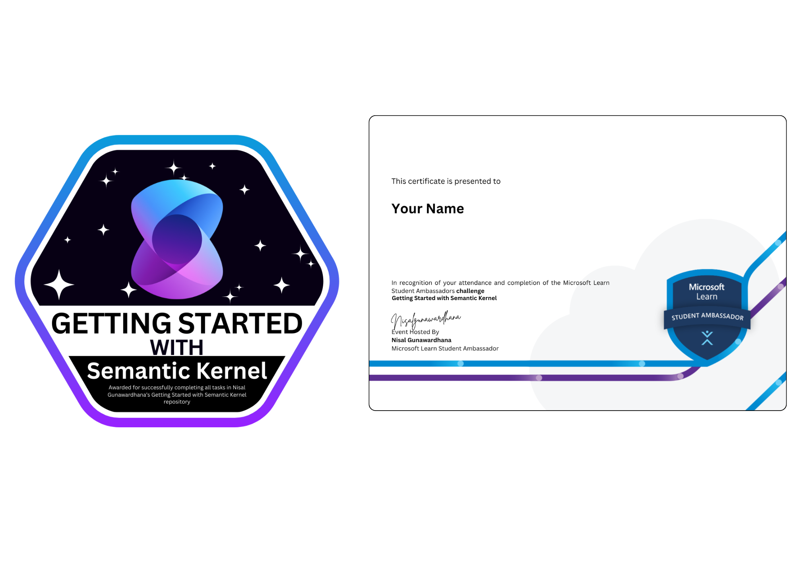

# Getting Started with Semantic Kernel

This repository provides a hands-on introduction to Microsoft's Semantic Kernel, a lightweight SDK designed to orchestrate AI services and traditional code. This guide will help you set up, run, and understand the basics of Semantic Kernel through a practical example.

[](https://github.com/nisalgunawardhana)

## What is Semantic Kernel?

Semantic Kernel is an open-source SDK that integrates Large Language Models (LLMs) with conventional programming languages. At its core, the Semantic Kernel:

- Acts as a **Dependency Injection container** managing services and plugins for your AI application
- Provides a consistent interface to work with different AI services (OpenAI, Azure OpenAI, etc.)
- Enables you to combine AI capabilities with traditional code through plugins
- Supports function calling to let AI models interact with your code

## Table of Contents

- [Prerequisites](#prerequisites)
- [Project Setup](#project-setup)
- [Environment Configuration](#environment-configuration)
- [Understanding the Code](#understanding-the-code)
  - [The Kernel](#the-kernel)
  - [Plugins](#plugins)
  - [Chat Functionality](#chat-functionality)
- [Running the Application](#running-the-application)
- [Learning Activities](#learning-activities)
- [Troubleshooting](#troubleshooting)

## Prerequisites

- [.NET SDK 9.0](https://dotnet.microsoft.com/download) or later
- Azure account with access to Azure OpenAI Service
- Basic understanding of C# programming

## Project Setup & Submission Process

1. Fork this repository on GitHub (click the "Fork" button at the top right)

2. Clone your forked repository:
   ```bash
   git clone https://github.com/YOUR-USERNAME/Getting-started-with-Semantic-Kernel.git
   cd Getting-started-with-Semantic-Kernel
   ```

3. Create a submission branch:
   ```bash
   git checkout -b submission
   ```

4. Install the required packages (already defined in the project file):
   ```bash
   dotnet restore
   ```

## Environment Configuration

1. Create a `.env` file in the root directory by copying the example:
   ```bash
   cp example.env .env
   ```

2. Edit the `.env` file with your Azure OpenAI credentials:
   ```
   MODEL_ID=your-model-id
   AZURE_OPENAI_ENDPOINT=https://your-resource-name.openai.azure.com/
   AZURE_OPENAI_API_KEY=your-api-key
   ```

   > **Where to get these credentials:**
   > 
   > 1. **Create an Azure OpenAI resource** via [Azure AI Foundry](https://ai.azure.com) or [Azure Portal](https://portal.azure.com)
   > 2. Deploy a model (like gpt-4, gpt-35-turbo, etc.)
   > 3. In your resource, find your endpoint URL and API key in the "Keys and Endpoint" section
   > 4. The MODEL_ID is the name you gave to your deployed model

## Understanding the Code

### The Kernel

In `Program.cs`, we create and configure a Semantic Kernel instance. The kernel is the central component that:

```csharp
// Create a kernel with Azure OpenAI chat completion
var builder = Kernel.CreateBuilder().AddAzureOpenAIChatCompletion(modelId, endpoint, apiKey);

// Add enterprise components
builder.Services.AddLogging(services => services.AddConsole().SetMinimumLevel(LogLevel.Trace));

// Build the kernel
Kernel kernel = builder.Build();
```

The kernel:
- Connects to AI services (Azure OpenAI in this case)
- Manages plugins and services
- Provides a consistent interface for prompt execution
- Coordinates function calling between the LLM and your code

### Plugins

The `LightsPlugin.cs` file demonstrates how to create a custom plugin:

```csharp
[KernelFunction("get_lights")]
[Description("Gets a list of lights and their current state")]
public Task<List<LightModel>> GetLightsAsync()
{
    return Task.FromResult(lights);
}

[KernelFunction("change_state")]
[Description("Changes the state of the light")]
public Task<LightModel?> ChangeStateAsync(int id, bool isOn)
{
    // ...
}
```

Key aspects of plugins:
- Methods are decorated with `[KernelFunction]` to expose them to the kernel
- `[Description]` attributes help the LLM understand when to use each function
- Return types are serialized and can be understood by the LLM
- Plugins are registered with the kernel: `kernel.Plugins.AddFromType<LightsPlugin>("Lights");`

### Chat Functionality

The program implements a chat loop that:
1. Takes user input
2. Adds it to a conversation history
3. Sends the conversation to the LLM through the kernel
4. Retrieves and displays the AI's response
5. Allows the AI to call plugin functions when needed

## Running the Application

Execute the following command in the project directory:

```bash
dotnet run
```

This starts an interactive chat session where you can:
- Ask about the lights (e.g., "What lights do I have?")
- Control the lights (e.g., "Turn on the table lamp")
- Ask general questions (handled by the LLM)

Example conversation:
```
User > What lights do I have?
Assistant > You have the following lights:
1. Table Lamp (currently OFF)
2. Porch light (currently OFF)
3. Chandelier (currently ON)

User > Turn on the porch light
Assistant > I've turned on the Porch light for you. It's now ON.
```

## Learning Activities

To deepen your understanding of Semantic Kernel:

1. **Create a new plugin**:
   - Implement a "Weather" plugin that returns mock weather data
   - Register it with the kernel and test queries about the weather

2. **Experiment with prompting**:
   - Try different ways of asking the assistant to control lights
   - Notice how the LLM determines when to call functions vs. responding directly

3. **Explore function calling**:
   - Look at the `FunctionChoiceBehavior.Auto()` setting and how it affects function calls
   - Try adding constraints to function parameters

## Completing Your Submission

After you've completed the learning activities and made your changes:

1. **Commit and push your changes to your submission branch**
   ```bash
   git add .
   git commit -m "Completed learning activities"
   git push origin submission
   ```
x
2. **Create a Pull Request in your forked repository**
   - Go to your forked repository on GitHub
   - Click on "Pull Requests" > "New Pull Request"
   - Set the base branch to your main branch (not nisalgunawardhana's main)
   - Set the compare branch to your submission branch
   - Click "Create Pull Request"
   - Add a descriptive title and description
   - **Important:** Do not merge this pull request

   - Create a pull request from your `submission` branch to the `main` branch on the Your repository.

   
   

    Follow the above images for a visual guide on creating a pull request.

   **Tip:** After creating your pull request, copy the PR link from your browser's address bar. You will need this link when creating your submission issue in the next step.

   

   > **Note:** The images above demonstrate how to select the correct branches and create a pull request. The repository name shown in the screenshots may differ from yours—just follow the same steps for your own repository.


3. **Submit your work**
- Go to the original repository: [https://github.com/nisalgunawardhana/Getting-started-with-Semantic-Kernel](https://github.com/nisalgunawardhana/Getting-started-with-Semantic-Kernel)
    - Create a new issue using the "Submission" issue template
    - Fill in:
        - Your full name
        - Link to your pull request
        - Summary of what you learned
    - Submit the issue

Once you submit, your work will be reviewed. If you have completed everything correctly, you will be assigned a digital badge for completion.



## Semantic Kernel Architecture

Semantic Kernel is designed with modular components that enable flexible integration of AI capabilities into your applications. Here’s a deeper look at its architecture:

### AI Service Connectors
Connectors abstract the interaction with various AI services, allowing you to switch providers or models with minimal code changes. Supported capabilities include:
- **Chat Completion:** Enables conversational AI using LLMs (e.g., GPT-4, GPT-3.5).
- **Text Generation:** Produces text based on prompts, useful for summarization, content creation, etc.
- **Embedding Generation:** Converts text into vector representations for semantic search and similarity tasks.
- **Multimodal Conversion:** Handles text, image, and audio processing (where supported by the underlying AI service).

### Vector Store (Memory) Connectors
Memory connectors integrate with vector databases to provide persistent, searchable storage for embeddings. They support:
- **Storing Embeddings:** Save vector representations of text, images, or other data.
- **Semantic Search:** Retrieve relevant information based on similarity, enabling context-aware responses.
- **RAG (Retrieval Augmented Generation):** Combine LLMs with external knowledge sources for more accurate and grounded answers.

### Functions and Plugins
Semantic Kernel organizes logic into plugins and functions:
- **Plugins:** Named containers grouping related functions, making them discoverable and callable by the kernel or LLM.
- **Functions:** Units of work that can be:
    - **Native code:** C# methods (e.g., `LightsPlugin`) exposed via attributes.
    - **OpenAPI specs:** Functions generated from API definitions for external service calls.
    - **Text Search implementations:** Custom search logic for semantic memory.
    - **Prompt templates:** Functions defined by prompt instructions, enabling dynamic AI behaviors.

### Prompt Templates
Prompt templates are reusable instructions that guide LLM behavior. They can include:
- **Context and Instructions:** Background information and explicit guidance for the model.
- **User Input:** Dynamic data from users or other sources.
- **Function Calls:** Embedded calls to plugins/functions for hybrid AI+code workflows.
- **Placeholders:** Variables replaced at runtime for personalized or context-aware prompts.

### Filters
Filters are extensibility points for customizing kernel behavior. They allow you to inject logic:
- **Before/After Function Invocation:** Pre-process inputs or post-process outputs for functions.
- **Before/After Prompt Rendering:** Modify prompts or results, enabling logging, validation, or transformation.

These components work together to provide a robust framework for building intelligent, extensible applications with AI at their core.

## Troubleshooting

### Common Issues

1. **"MODEL_ID not found in environment"**
   - Ensure your `.env` file exists and contains the correct variable names
   - Check that DotNetEnv is correctly loading the file

2. **Authorization Errors**
   - Verify your API key is correct
   - Ensure your Azure subscription has access to Azure OpenAI

3. **Model Not Found**
   - Confirm you've deployed the model in Azure OpenAI Service
   - Make sure the MODEL_ID matches your deployed model name

4. **Build Errors**
   - Run `dotnet restore` to ensure all packages are installed
   - Check for compatibility issues between package versions

## Resources

- [Semantic Kernel Documentation](https://learn.microsoft.com/en-us/semantic-kernel/)
- [GitHub Repository](https://github.com/microsoft/semantic-kernel)
- [Azure OpenAI Documentation](https://learn.microsoft.com/en-us/azure/ai-services/openai/)


## 💬 Join the Discussion!

Have questions, ideas, or want to share your experience?  
We welcome you to use [GitHub Discussions](https://github.com/nisalgunawardhana/Getting-started-with-Semantic-Kernel/discussions) for:

- Asking questions about setup or usage
- Sharing feedback or suggestions
- Requesting new features
- Connecting with other contributors

👉 **Click the "Discussions" tab at the top of this repo to start or join a conversation!**

Let's build and learn together!

---

## Connect with Me

Follow me on social media for more sessions, tech tips, and giveaways:

- [LinkedIn](https://www.linkedin.com/in/nisalgunawardhana/) — Professional updates and networking
- [Twitter (X)](https://x.com/thenisals) — Insights and announcements
- [Instagram](https://www.instagram.com/thenisals) — Behind-the-scenes and daily tips
- [GitHub](https://github.com/nisalgunawardhana) — Repositories and project updates
- [YouTube](https://www.youtube.com/channel/UCNP5-zR4mN6zkiJ9pVCM-1w) — Video tutorials and sessions

Feel free to connect and stay updated!

---

## License

MIT

